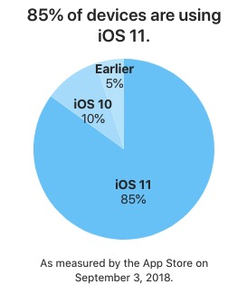

# Westore Proxy 版本【未发布】

> 世界上最小却强大的小程序框架 - [100多行代码](https://github.com/dntzhang/westore/blob/master/utils/create2.js)搞定全局状态管理和跨页通讯

---

- [API](#api)
- [使用指南](#使用指南)
	- [定义全局 store](#定义全局-store)
  - [创建页面](#创建页面)
  - [绑定数据](#绑定数据)
  - [更新页面](#更新页面)
  - [创建组件](#创建组件)
  - [更新组件](#更新组件)
  - [与 setData 对比](#与-setdata-对比)
  - [跨页面同步数据](#跨页面同步数据)
- [原理](#原理)
  - [Hello Proxy](#hello-proxy)
  - [Proxy+Diff](#proxy+diff)
  - [Proxy Path](#proxy-path)
  - [Update](#update)
- [License](#license)

## API

Westore Proxy API 只有四个, 大道至简:

* create(store, option) 创建页面
* create(option)        创建组件
* this.update(data)   更新页面或组件，其中 data 为必选，data 的格式和 setData 一致
* store.update(data)   更新页面或组件，在非页面非组件的 js 文件中使用

和 1.0 相比，API 没有变化，但是 this.update 不传参就没有必要调用了，数据变更会自动刷新视图

## 使用指南

### 定义全局 store

```js
export default {
  data: {
    motto: 'Hello World',
    userInfo: {},
    hasUserInfo: false,
    canIUse: wx.canIUse('button.open-type.getUserInfo'),
    logs: []
  },
  logMotto: function () {
    console.log(this.data.motto)
  }
}
```

你不需要在页面和组件上再声明 data 属性。如果申明了也没关系，会被 Object.assign 覆盖到 store.data 上。后续只需修改 this.store.data 便可。

### 创建页面

```js
import store from '../../store'
import create from '../../utils/create'

const app = getApp()

create(store, {

  onLoad: function () {
    if (app.globalData.userInfo) {
      this.store.data.userInfo = app.globalData.userInfo
      this.store.data.hasUserInfo = true
    } else if (this.data.canIUse) {
      app.userInfoReadyCallback = res => {
        //也可使用 Object.assign
        Object.assign(this.store.data, {
          userInfo: res.userInfo,
          hasUserInfo: true
        })
      }
    } else {
      wx.getUserInfo({
        success: res => {
          app.globalData.userInfo = res.userInfo
          this.store.data.userInfo = res.userInfo
          this.store.data.hasUserInfo = true
        }
      })
    }
  }

})
```

创建 Page 只需传入两个参数，store 从根节点注入，所有子组件都能通过 this.store 访问。

### 绑定数据

```jsx
<view class="container">
   
  <view class="userinfo">
    <button wx:if="{{!hasUserInfo && canIUse}}" open-type="getUserInfo" bindgetuserinfo="getUserInfo"> 获取头像昵称 </button>
    <block wx:else>
      <image bindtap="bindViewTap" class="userinfo-avatar" src="{{userInfo.avatarUrl}}" mode="cover"></image>
      <text class="userinfo-nickname">{{userInfo.nickName}}</text>
    </block>
  </view>
  <view class="usermotto">
    <text class="user-motto">{{motto}}</text>
  </view>

  <hello></hello>
</view>
```

和以前的写法没有差别，直接把 `store.data` 作为绑定数据源。 

### 更新页面

```js
this.store.data.any_prop_you_want_to_change = 'any_thing_you_want_change_to'
//this.update()
```

### 创建组件

```js

import create from '../../utils/create'

create({
  ready: function () {
   //you can use this.store here
  },

  methods: {
    //you can use this.store here
  }
})

```
和创建 Page 不一样的是，创建组件只需传入一个参数，不需要传入 store，因为已经从根节点注入了。

### 更新组件

```js
this.store.data.any_prop_you_want_to_change = 'any_thing_you_want_change_to'
//this.update()
```

### setData 和 update 对比

拿官方模板示例的 log 页面作为例子:

```js
this.setData({
  logs: (wx.getStorageSync('logs') || []).map(log => {
    return util.formatTime(new Date(log))
  })
})
```

使用 westore 后:

``` js
this.store.data.logs = (wx.getStorageSync('logs') || []).map(log => {
  return util.formatTime(new Date(log))
})
//this.update()
```

方法调用直接变成赋值操作，编程体验来讲 assignment > method call。

### 跨页面同步数据

使用 westore 你不用关心跨页数据同步，你只需要专注 this.store.data 便可，修改完会自动跨页同步数据。

## 原理

### Proxy 简介

```js
const handler = {
    get: function (target, key, receiver) {
        try {
            if (typeof target[key] === 'function') return Reflect.get(target, key, receiver)
            return new Proxy(target[key], handler)
        } catch (err) {
            return Reflect.get(target, key, receiver)
        }
    },
    set: function (target, key, value, receiver) {
        Reflect.set(target, key, value, receiver)
        update()
        return true
    },
    deleteProperty: function (target, key) {
        Reflect.deleteProperty(target, key)
        update()
        return true
    }
}

function update() {
    //diff 吗？
    for (let key in currentStore.instances) {
        currentStore.instances[key].forEach(ins => {
            ins.setData.call(ins, currentData)
        })
    }
}
```

## Proxy 兼容性



## License
MIT [@dntzhang](https://github.com/dntzhang)
