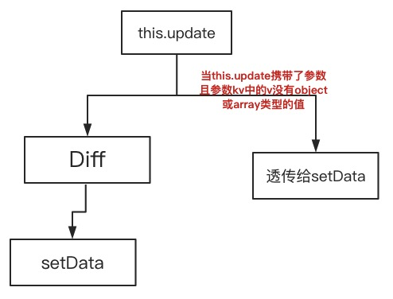
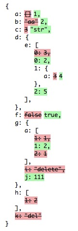

# Westore 1.0 正式发布 - 一个框架就够

> 世界上最小却强大的小程序框架 - [100多行代码](https://github.com/dntzhang/westore/blob/master/utils/create.js)搞定全局状态管理和跨页通讯

众所周知，小程序通过页面或组件各自的 setData 再加上各种父子、祖孙、姐弟、嫂子与堂兄等等组件间的通讯会把程序搞成一团浆糊，如果再加上跨页面之间的组件通讯，会让程序非常难维护和调试。虽然市面上出现了许多技术栈编译转小程序的技术，但是我觉没有戳中小程序的痛点。小程序不管从组件化、开发、调试、发布、灰度、回滚、上报、统计、监控和最近的云能力都非常完善，小程序的工程化简直就是前端的典范。而开发者工具也在持续更新，可以想象的未来，组件布局的话未必需要写代码了。而且据统计，开发小程序使用最多的技术栈是使用小程序本身的开发工具和语法，所以最大的痛点只剩下状态管理和跨页通讯。

受 [Omi 框架](https://github.com/Tencent/omi) 的启发，且专门为小程序开发的 [JSON Diff 库](https://github.com/dntzhang/westore/blob/master/utils/diff.js)，所以有了 westore 全局状态管理和跨页通讯框架让一切尽在掌握中，且受高性能 JSON Diff 库的利好，长列表滚动加载显示变得轻松可驾驭。总结下来有如下特性和优势:

* 和 Omi 同样简洁的 Store API
* 超小的代码尺寸(包括 json diff 共100多行)
* 尊重且顺从小程序的设计(其他转译库相当于反其道行)
* this.update 兼容 setData 同样的语法
* this.update 比原生 setData 的性能更优，更加智能
* Westore 专为小程序插件开发[定制了模板](https://github.com/dntzhang/westore/tree/master/packages/westore-plugin)

总结下小程序的痛点:

* 使用 this.data 可以获取内部数据和属性值，但不要直接修改它们，应使用 setData 修改
* setData 编程体验不好，很多场景直接赋值更加直观方便
* setData 卡卡卡慢慢慢，JsCore 和 Webview 数据对象来回传浪费计算资源和内存资源
* 组件间通讯或跨页通讯会把程序搞得乱七八糟，变得极难维护和扩展 

所以没使用 westore 的时候经常可以看到这样的代码:


使用完 westore 之后:


上面两种方式也可以混合使用。

可以看到，westore 不仅支持直接赋值，而且 this.update 兼容了 this.setData 的语法，但性能大大优于 this.setData，再举个例子：

``` js
this.store.data.motto = 'Hello Store222'
this.store.data.b.arr.push({ name: 'ccc' })
this.update()
```

等同于

``` js
this.update({
  motto:'Hello Store222',
  [`b.arr[${this.store.data.b.arr.length}]`]:{name:'ccc'}
})
```

这里需要特别强调，虽然 this.update 可以兼容小程序的 this.setData 的方式传参，但是更加智能，this.update 会按需 Diff 或者 透传给 setData。原理:



---

- [API](#api)
- [使用指南](#使用指南)
	- [定义全局 store](#定义全局-store)
  - [创建页面](#创建页面)
  - [绑定数据](#绑定数据)
  - [更新页面](#更新页面)
  - [创建组件](#创建组件)
  - [更新组件](#更新组件)
  - [setData 和 update 对比](#setdata-和-update-对比)
  - [跨页面同步数据](#跨页面同步数据)
  - [调试](#调试)
  - [超大型小程序最佳实践](#超大型小程序最佳实践两种方案)
  - [局部 Store 开发 Plugin](./westore-plugin.md) 
- [原理](#原理)
  - [JSON Diff](#json-diff)
  - [Update](#update)
- [License](#license)

## API

Westore API 只有四个, 大道至简:

* create(store, option) 创建页面
* create(option)        创建组件
* this.update([data])   更新页面或组件，其中 data 为可选，data 的格式和 setData 一致
* store.update([data])   更新页面或组件，在非页面非组件的 js 文件中使用

## 使用指南

### 定义全局 store

```js
export default {
  data: {
    motto: 'Hello World',
    userInfo: {},
    hasUserInfo: false,
    canIUse: wx.canIUse('button.open-type.getUserInfo'),
    logs: []
  },
  logMotto: function () {
    console.log(this.data.motto)
  }
}
```

你不需要在页面和组件上再声明 data 属性。如果申明了也没关系，会被 Object.assign 覆盖到 store.data 上。后续只需修改 this.store.data 便可。

### 创建页面

```js
import store from '../../store'
import create from '../../utils/create'

const app = getApp()

create(store, {

  onLoad: function () {
    if (app.globalData.userInfo) {
      this.store.data.userInfo = app.globalData.userInfo
      this.store.data.hasUserInfo = true
      this.update()
    } else if (this.data.canIUse) {
      app.userInfoReadyCallback = res => {
        this.store.data.userInfo = res.userInfo
        this.store.data.hasUserInfo = true
        this.update()
      }
    } else {
      wx.getUserInfo({
        success: res => {
          app.globalData.userInfo = res.userInfo
          this.store.data.userInfo = res.userInfo
          this.store.data.hasUserInfo = true
          this.update()
        }
      })
    }
  }

})
```

创建 Page 只需传入两个参数，store 从根节点注入，所有子组件都能通过 this.store 访问。

### 绑定数据

```jsx
<view class="container">
   
  <view class="userinfo">
    <button wx:if="{{!hasUserInfo && canIUse}}" open-type="getUserInfo" bindgetuserinfo="getUserInfo"> 获取头像昵称 </button>
    <block wx:else>
      <image bindtap="bindViewTap" class="userinfo-avatar" src="{{userInfo.avatarUrl}}" mode="cover"></image>
      <text class="userinfo-nickname">{{userInfo.nickName}}</text>
    </block>
  </view>
  <view class="usermotto">
    <text class="user-motto">{{motto}}</text>
  </view>

  <hello></hello>
</view>
```

和以前的写法没有差别，直接把 `store.data` 作为绑定数据源。 

### 更新页面

```js
this.store.data.any_prop_you_want_to_change = 'any_thing_you_want_change_to'
this.update()
```

### 创建组件

```js

import create from '../../utils/create'

create({
  ready: function () {
   //you can use this.store here
  },

  methods: {
    //you can use this.store here
  }
})

```
和创建 Page 不一样的是，创建组件只需传入一个参数，不需要传入 store，因为已经从根节点注入了。

### 更新组件

```js
this.store.data.any_prop_you_want_to_change = 'any_thing_you_want_change_to'
this.update()
```

### setData 和 update 对比

拿官方模板示例的 log 页面作为例子:

```js
this.setData({
  logs: (wx.getStorageSync('logs') || []).map(log => {
    return util.formatTime(new Date(log))
  })
})
```

使用 westore 后:

``` js
this.store.data.logs = (wx.getStorageSync('logs') || []).map(log => {
  return util.formatTime(new Date(log))
})
this.update()
```

看似一条语句变成了两条语句，但是 this.update 调用的 setData 是 diff 后的，所以传递的数据更少。

### 跨页面同步数据

使用 westore 你不用关心跨页数据同步，你只需要专注 this.store.data 便可，修改完在任意地方调用 update 便可：

```js
this.update()
```

### 调试

```js
console.log(getApp().globalData.store.data)
```

### 超大型小程序最佳实践(两种方案)

不排除小程序被做大得可能，接触的最大的小程序有 60+ 的页面，所以怎么管理？这里给出了两个最佳实践方案。

* 第一种方案，拆分 store 的 data 为不同模块，如:

```js
export default {
  data: {
    commonA: 'a',
    commonB: 'b',
    pageA: {
      a: 1
      xx: 'xxx'
    },
    pageB: {
      b: 2,
      c: 3
    }
  },
  xxx: function () {
    console.log(this.data)
  }
}
```

* 第二种方案，拆分 store 的 data 到不同文件且合并到一个 store 暴露给 create 方法，如：

a.js

```js
export default {
  data: {
    a: 1
    xx: 'xxx'
  },
  aMethod: function (num) {
    this.data.a += num
  }
}
```

b.js


```js
export default {
  data: {
    b: 2,
    c: 3
  },
  bMethod: function () {
    
  }
}
```

store.js

```js
import a from 'a.js'
import b from 'b.js'

export default {
  data: {
    commonNum: 1,
    commonB: 'b',
    pageA: a.data
    pageB: b.data
  },
  xxx: function () {
    //you can call the methods of a or b and can pass args to them
    console.log(a.aMethod(commonNum))
  },
  xx: function(){

  }
}
```

当然，也可以不用按照页面拆分文件或模块，也可以按照领域来拆分，这个很自由，视情况而定。

## 原理

```
 ---------------       -------------------        -----------------------
| this.update  |  →  |     json diff     |   →  | setData()-setData()...|  →  之后就是黑盒(小程序官方实现，但是 dom/apply diff 肯定是少不了)
 ---------------       -------------------        -----------------------
```

虽然和 Omi 一样同为 this.updata 但是却有着本质的区别。Omi 的如下:

```
 ---------------       -------------------        ----------------         ------------------------------
|  this.update  |  →  |     setState      |   →  |  jsx rerender  |   →   |   vdom diff → apply diff...  |
 ---------------       -------------------        ----------------         ------------------------------
```

都是数据驱动视图，但本质不同，原因:

* 小程序 store 和 dom 不在同一个环境，先在 js 环境进行 json diff，然后使用 diff 结果通过 setData 通讯告诉 webview
* Web 里使用 omi 的话 store 和 dom 在同一环境，setState 直接驱动的 vdom diff 然后把 diff 结果作用在真实 dom 上
* Native 里使用 omi 的话，omi 通过 jsbridge 向 客户端发送的是 dom 指令而非 数据

### JSON Diff

先看一下我为 westore 专门定制开发的 [JSON Diff 库](https://github.com/dntzhang/westore/blob/master/utils/diff.js) 的能力:

``` js
diff({
    a: 1, b: 2, c: "str", d: { e: [2, { a: 4 }, 5] }, f: true, h: [1], g: { a: [1, 2], j: 111 }
}, {
    a: [], b: "aa", c: 3, d: { e: [3, { a: 3 }] }, f: false, h: [1, 2], g: { a: [1, 1, 1], i: "delete" }, k: 'del'
})
```

Diff 的结果是:

``` js
{ "a": 1, "b": 2, "c": "str", "d.e[0]": 2, "d.e[1].a": 4, "d.e[2]": 5, "f": true, "h": [1], "g.a": [1, 2], "g.j": 111, "g.i": null, "k": null }
```



Diff 原理:

* 同步所有 key 到当前 store.data
* 携带 path 和 result 递归遍历对比所有 key value

``` js
export default function diff(current, pre) {
    const result = {}
    syncKeys(current, pre)
    _diff(current, pre, '', result)
    return result
}
```

同步上一轮 state.data 的 key 主要是为了检测 array 中删除的元素或者 obj 中删除的 key。

### 小程序 setData

setData 是小程序开发中使用最频繁的接口，也是最容易引发性能问题的接口。在介绍常见的错误用法前，先简单介绍一下 setData 背后的工作原理。setData 函数用于将数据从逻辑层发送到视图层（异步），同时改变对应的 this.data 的值（同步）。

其中 key 可以以数据路径的形式给出，支持改变数组中的某一项或对象的某个属性，如 array[2].message，a.b.c.d，并且不需要在 this.data 中预先定义。比如：

```js
this.setData({
      'array[0].text':'changed data'
})
```

所以 diff 的结果可以直接传递给 `setData`，也就是 `this.update`。

#### setData 工作原理

小程序的视图层目前使用 WebView 作为渲染载体，而逻辑层是由独立的 JavascriptCore 作为运行环境。在架构上，WebView 和 JavascriptCore 都是独立的模块，并不具备数据直接共享的通道。当前，视图层和逻辑层的数据传输，实际上通过两边提供的 evaluateJavascript 所实现。即用户传输的数据，需要将其转换为字符串形式传递，同时把转换后的数据内容拼接成一份 JS 脚本，再通过执行 JS 脚本的形式传递到两边独立环境。

而 evaluateJavascript 的执行会受很多方面的影响，数据到达视图层并不是实时的。

常见的 setData 操作错误:

* 频繁的去 setData
* 每次 setData 都传递大量新数据
* 后台态页面进行 setData

上面是官方截取的内容。使用 webstore 的 this.update 本质是先 diff，再执行一连串的 setData，所以可以保证传递的数据每次维持在最小。既然可以使得传递数据最小，所以第一点和第三点虽有违反但可以商榷。

### Update 

#### 页面生命周期函数

| 名称 | 描述  |
| ------ | ------  |
| onLoad | 	监听页面加载	  |
| onShow | 监听页面显示	  |
| onReady | 监听页面初次渲染完成  |
| onHide | 监听页面隐藏	  |
| onUnload | 监听页面卸载  |

这里区分在页面中的 update 和 组件中的 update。页面中的 update 在 onLoad 事件中进行实例收集。

```js
const onLoad = option.onLoad
option.onLoad = function () {
    this.store = store
    rewriteUpdate(this)
    store.instances[this.route] = []
    store.instances[this.route].push(this)
    onLoad && onLoad.call(this)
}
Page(option)
```

组件中的 update 在 ready 事件中进行行实例收集:

```js
const ready = store.ready
store.ready = function () {
    this.page = getCurrentPages()[getCurrentPages().length - 1]
    this.store = this.page.store
    this.setData.call(this, this.store.data)
    rewriteUpdate(this)
    this.store.instances[this.page.route].push(this)
    ready && ready.call(this)
}
Component(store)
```

rewriteUpdate 的实现如下:

``` js
function rewriteUpdate(ctx) {
    ctx.update = (patch) => {
        let needDiff = false
        let diffResult = patch
        if (patch) {
            for (let key in patch) {
                updateByPath(ctx.store.data, key, patch[key])
                if (typeof patch[key] === 'object') {
                    needDiff = true
                }
            }
        } else {
            needDiff = true
        }
        if (needDiff) {
            diffResult = diff(ctx.store.data, originData)
        }
        for (let key in ctx.store.instances) {
            ctx.store.instances[key].forEach(ins => {
                ins.setData.call(ins, diffResult)
            })
        }
        ctx.store.onChange && ctx.store.onChange(diffResult)
        for (let key in diffResult) {
            updateByPath(originData, key, diffResult[key])
        }
    }
}
```

westore 会收集所有页面和组件的实例，在开发者执行 this.update 的时候遍历所有实例进行 setData。

## License
MIT [@dntzhang](https://github.com/dntzhang)
