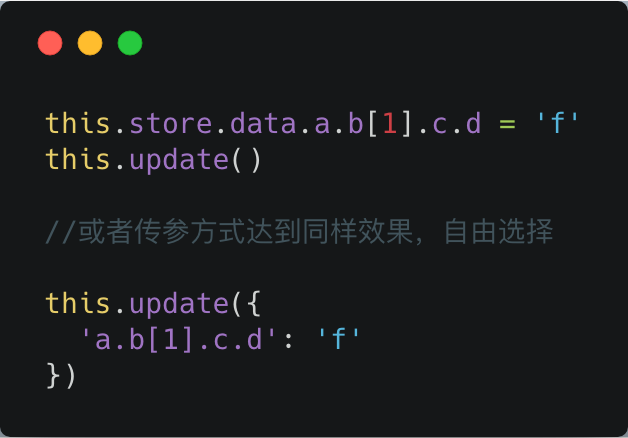

# Westore 助力小程序插件开发

Westore 开源两天就突破了 1000 star，受到了海量关注，收到了大量的中肯和实用的反馈和意见。小程序插件开发是意见之一。

先回顾一下 Westore 对编程体验的改善。

由于这个条款的存在：

> 使用 this.data 可以获取内部数据和属性值，但不要直接修改它们，应使用 setData 修改，

所以没使用 westore 的时候经常可以看到这样的代码:


使用完 westore 之后:



---

## 小程序插件

小程序插件是对一组 js 接口、自定义组件或页面的封装，用于嵌入到小程序中使用。插件不能独立运行，必须嵌入在其他小程序中才能被用户使用；而第三方小程序在使用插件时，也无法看到插件的代码。因此，插件适合用来封装自己的功能或服务，提供给第三方小程序进行展示和使用。

插件开发者可以像开发小程序一样编写一个插件并上传代码，在插件发布之后，其他小程序方可调用。小程序平台会托管插件代码，其他小程序调用时，上传的插件代码会随小程序一起下载运行。

* [插件开发者文档](https://developers.weixin.qq.com/miniprogram/dev/framework/plugin/development.html)
* [插件使用者文档](https://developers.weixin.qq.com/miniprogram/dev/framework/plugin/using.html)

## 插件开发

插件可以是纯 js 接口(自建npm的味道)，自定义组件或页面的封装。

创建插件:

```js
import create from '../../westore/create-plugin'
import store from '../../store'

//最外层容器节点需要传入 store，其他组件不传 store
create(store, {
  properties:{
    authKey:{
      type: String,
      value: ''
    }
  },
  data: { list: [] },
  attached: function () {
    // 可以得到插件上声明传递过来的属性值
    console.log(this.properties.authKey)
    // 监听所有变化
    this.store.onChange = (detail) => {
      this.triggerEvent('listChange', detail)
    }
    // 可以在这里发起网络请求获取插件的数据
    this.store.data.list = [{
      name: '电视',
      price: 1000
    }, {
      name: '电脑',
      price: 4000
    }, {
      name: '手机',
      price: 3000
    }]

    this.update()
  }
})
```

在你的小程序中使用组件：

```js
<list auth-key="{{authKey}}" bind:listChange="onListChange" />
```

这里来梳理下小程序自定义组件插件怎么和使用它的小程序通讯:

* 通过 properties 传入更新插件，通过 properties 的 observer 来更新插件
* 通过 store.onChange 收集 data 的所有变更
* 通过 triggerEvent 来抛事件给使用插件外部的小程序

这么方便简洁还不赶紧试试 [Westore插件开发模板](https://github.com/dntzhang/westore/tree/master/packages/westore-plugin) ！

## 特别强调

插件内所有组件公用的 store 和插件外小程序的 store 是相互隔离的。 

## License
MIT [@dntzhang](https://github.com/dntzhang)
